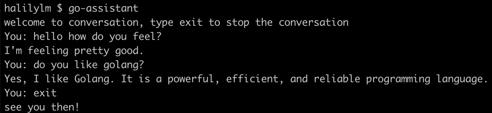

## Go ChatGPT

Chat GPT assistant written in GO.

[](https://www.buymeacoffee.com/HxbwM8Z)

## Installation

Install go-assistant with go install

```bash
  go install github.com/halilylm/go-assistant@v0.1.0
```

## Usage/Examples

```bash
go-assistant
```

if you are getting an error, you need to add `$GOPATH/bin` to the path.
You can find your `$GOPATH` by running `go env` command.

When it is your first time using it, you need to paste your API key.
This program will automatically open a browser to find your API key.
After saving your API key, it won't ask again as long as this API key valid.

## Demo


